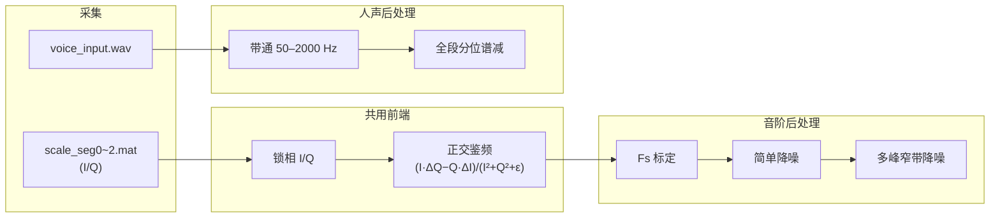

# Remote LDV Acoustic Sensing

**基于正交鉴频架构的激光多普勒远程侦听 — 信号处理与验证**

从锁相 **I/Q** 数据出发，经正交鉴频、采样率标定与分级降噪，还原可听音频，并用**分段音阶**与**连续人声**两条链路完成系统验证。全程 **Python** 实现，附带 MATLAB 参考脚本与答辩文档。

---

## 特性

- **正交鉴频**：笛卡尔域交叉相乘解调，避免散斑场景下 `atan2` + 相位解包裹失效
- **Fs 标定**：三段异构 MAT 拼接后，以中间段 1 kHz 主峰对齐，谱线落于 **500 / 1000 / 2000 Hz**
- **分级降噪**：简单谱减 + 固定带通 → 多峰自适应窄带增强
- **双路验证**：音阶（定量频谱）+ 人声（语谱与听感）
- **可复现**：一键流水线，路径与文件名集中在 `src/paths.py`

---

## 处理流程



---

## 环境要求

- Python **3.10+**
- 依赖见 [`requirements.txt`](requirements.txt)：`numpy`、`scipy`、`matplotlib`
- 生成 Word 文档（可选）：`pip install python-docx`

---

## 快速开始

```bash
git clone <your-repo-url>
cd stream音阶   # 或你的仓库目录名

pip install -r requirements.txt
```

将实验数据放入对应目录（若仓库未包含大文件）：

| 路径 | 内容 |
|------|------|
| `data/mat/scale_seg0.mat` | 音阶第 1 段 I/Q |
| `data/mat/scale_seg1.mat` | 音阶第 2 段 |
| `data/mat/scale_seg2.mat` | 音阶第 3 段 |
| `data/wav/voice_input.wav` | 人声（已鉴频输入） |

### 音阶（推荐一键运行）

```bash
python run_scale_pipeline.py
```

依次执行：还原 → 简单降噪 → 最终降噪 → 三联图。

### 人声

```bash
python src/denoise_voice.py
```

### 单步调试

```bash
python src/restore.py
python src/denoise_scale_simple.py
python src/denoise.py
python src/plot_scale_triptych.py
python src/plot_spectrum.py --wav output/wav/scale_restored.wav
```

---

## 主要输出

| 文件 | 说明 |
|------|------|
| `output/wav/scale_restored.wav` | 音阶 · 鉴频后（未降噪） |
| `output/wav/scale_denoised_simple.wav` | 音阶 · 简单降噪 |
| `output/wav/scale_denoised_final.wav` | 音阶 · 最终降噪 |
| `output/wav/voice_denoised.wav` | 人声 · 降噪后 |
| `output/figures/scale/triptych_welch.png` | 音阶 Welch 三联图 |
| `output/figures/scale/triptych_spectrogram.png` | 音阶语谱三联图 |
| `output/figures/voice/diptych_spectrogram.png` | 人声降噪前后语谱 |

典型标定结果：**Fs ≈ 13.4 kHz**，音阶主峰 **~500 / 1000 / 2000 Hz**。

---

## 仓库结构

```
.
├── run_scale_pipeline.py       # 音阶一键入口
├── src/
│   ├── paths.py                # 路径与标准文件名（全局配置）
│   ├── restore.py              # I/Q 拼接 · 鉴频 · Fs 标定
│   ├── denoise.py              # 谱减 + 多峰窄带（核心库 + CLI）
│   ├── denoise_scale_simple.py
│   ├── denoise_voice.py
│   ├── plot_scale_triptych.py
│   ├── plot_spectrum.py
│   ├── plot_poster_*.py        # 海报示意图
│   └── tools/                  # 讲稿 / 公式 Word 生成
├── data/
│   ├── mat/                    # 原始 MAT（I/Q）
│   └── wav/                    # 原始 WAV 输入
├── output/
│   ├── wav/
│   └── figures/{scale,voice,poster}/
├── docs/                       # 讲稿、公式推导
├── poster/                     # 海报 PPT / 文字稿
└── matlab/
    └── scale_pipeline.m        # MATLAB 参考实现
```

修改默认输入输出路径时，只需编辑 **`src/paths.py`**。

---

## 核心算法摘要

**正交鉴频**（与 `atan2 → unwrap → 微分` 在相位连续时等价）：

```
v(t) ∝ ( I·ΔQ − Q·ΔI ) / ( I² + Q² + ε )
```

**Fs 标定**（三段点数不同，不可用「总点数 ÷ 30 s」）：

```
Fs_out = Fs_trial × (f_nominal / f_peak)    # 默认 f_nominal = 1000 Hz
```

完整推导见 [`docs/公式推导.docx`](docs/公式推导.docx)（可用 `python src/tools/build_formula_docx.py` 重新生成）。

---

## MATLAB

```matlab
cd matlab
scale_pipeline   % 需 Signal Processing Toolbox
```

输出写入 `output/wav/scale_restored.wav`，鉴频核心与 Python 一致。

---

## 文档与答辩材料

| 文件 | 说明 |
|------|------|
| `docs/讲稿_完整版.md` | 答辩讲稿（含可选展开） |
| `docs/讲稿_7分钟.md` | 7 分钟版（含音频演示清单） |
| `docs/公式推导.docx` | 公式与代码对照 |
| `poster/` | 海报 PPT 与排版文字 |

```bash
python src/tools/md_to_docx.py              # 讲稿 → Word
python src/tools/md_to_docx.py 讲稿_7分钟
python src/tools/build_formula_docx.py
```

---

## 常见问题

**Q：为什么不用 atan2 解调？**  
散斑强时包裹相位在 ±π 跳变，解包裹失败会经微分放大为宽频伪峰；正交鉴频在 (I,Q) 平面直接求相位变化率。

**Q：Fs 能从鉴频公式直接得到吗？**  
不能。鉴频输出速度序列；Fs 需已知标称音调（本仓库用 1 kHz 段）或硬件采样时钟。

**Q：人声为什么不用开头 0.5 s 做谱减？**  
开头可能已是语音；`denoise_voice.py` 用全段各频点低分位数估计噪声底。

---

## 致谢与说明

本项目为**激光多普勒远程侦听**实验的数据处理与验证代码，光路采集与锁相 I/Q 由实验平台完成，本仓库侧重 **DSP 还原、标定与降噪**。

如在学术工作中使用，请注明出处并自行核对实验条件与绝对标度。

---

## License

学术 / 课程项目用途。实验原始数据（`.mat` 等）可能因体积未纳入仓库，请按上文路径自行放置。
